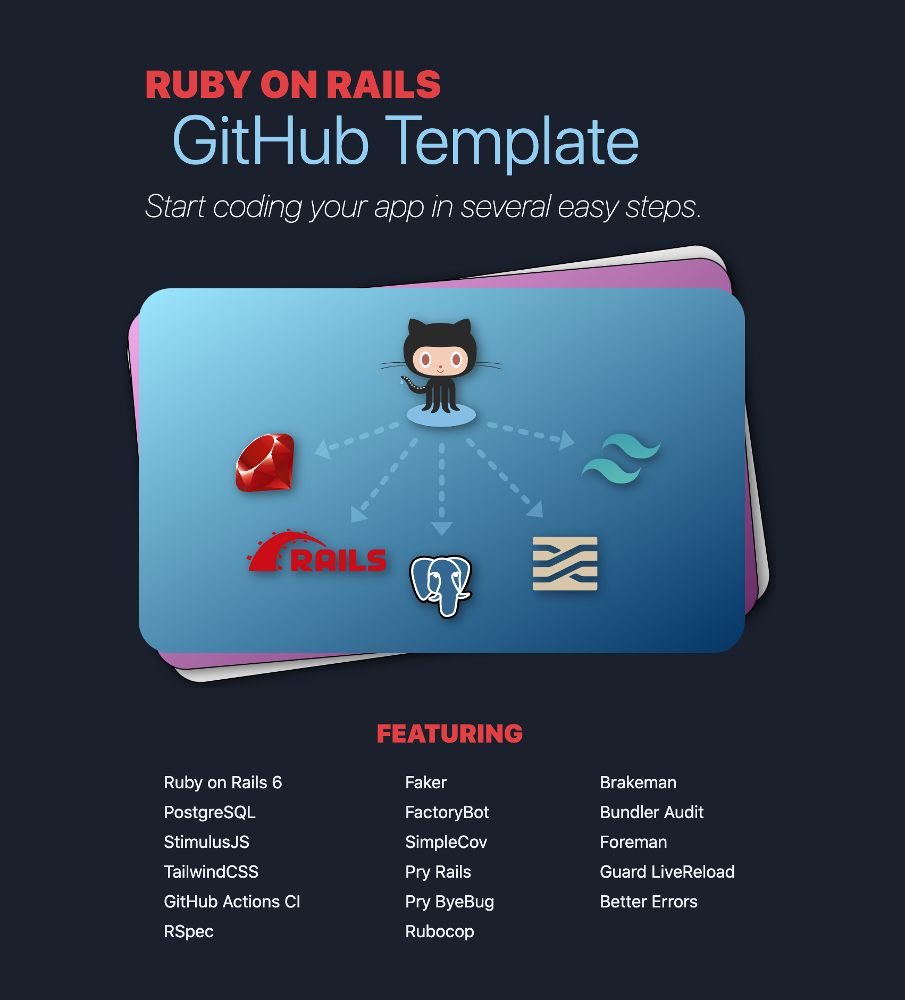

# Rails 6 GitHub Starter Template
Easy way to get a new Rails 6 project up and running. Includes Rails 6, PostgreSQL, StimulusJS, TailwindCSS, RSpec and includes a pre-configured GitHub Actions Workflow that checks code quailty, validates gems and runs tests.

GitHub Template repositories let users generate new repositories with the same directory structure and files. [Learn more.](https://docs.github.com/en/free-pro-team@latest/github/creating-cloning-and-archiving-repositories/creating-a-repository-from-a-template)

###  What's Included

#### Application

[Ruby on Rails 6.0.3.4](https://github.com/rails/rails) - A web-application framework that includes everything needed to create database-backed web applications according to the Model-View-Controller (MVC)

[Ruby 2.7.1](https://www.ruby-lang.org/en/news/2020/03/31/ruby-2-7-1-released/) - A dynamic, open source programming language with a focus on simplicity and productivity. It has an elegant syntax that is natural to read and easy to write.

[PostgreSQL](https://www.postgresql.org/) - PostgreSQL is a powerful, open source object-relational database system with over 30 years of active development that has earned it a strong reputation for reliability, feature robustness, and performance.

[Stimulus JS](https://stimulusjs.org/) - A modest JavaScript framework for the HTML you already have.

[tailwindcss](https://tailwindcss.com/) - A utility-first CSS framework for rapidly building custom designs.

####  Testing
[RSpec](https://github.com/rspec/rspec-rails) - Behaviour Driven Development for Ruby.

[factory_bot](https://github.com/thoughtbot/factory_bot) - A library for setting up Ruby objects as test data.

[faker](https://github.com/faker-ruby/faker) - A library for generating fake data such as names, addresses, phone numbers and more.

[simplecov](https://github.com/simplecov-ruby/simplecov) - Code coverage for Ruby with a powerful configuration library and automatic merging of coverage across test suites.

#### Development
[pry-rails](https://github.com/rweng/pry-rails) - A powerful alternative to the standard IRB shell for Ruby. It features syntax highlighting, a flexible plugin architecture, runtime invocation and source and documentation browsing.

[pry-byebug](https://github.com/deivid-rodriguez/pry-byebug) - Step-by-step debugging and stack navigation in Pry.

[rubocop](https://github.com/rubocop-hq/rubocop) - RuboCop is a Ruby static code analyzer (a.k.a. linter ) and code formatter. Out of the box it will enforce many of the guidelines outlined in the community.

[brakeman](https://github.com/presidentbeef/brakeman) - A static analysis security vulnerability scanner for Ruby on Rails applications

[bundler-audit](https://github.com/rubysec/bundler-audit) - Checks for vulnerable versions of gems & insecure gem sources.

[foreman](https://github.com/ddollar/foreman) - Manage Procfile-based applications.

[dotenv](https://github.com/bkeepers/dotenv) - A Ruby gem to load environment variables from `.env`.

[guard-livereload](https://github.com/guard/guard-livereload) -   Guard::LiveReload automatically reload your browser when 'view' files are modified.

[better_errors](https://github.com/BetterErrors/better_errors) - Better Errors replaces the standard Rails error page with a much better and more useful error page. It is also usable outside of Rails in any Rack app as Rack middleware.

[rename](https://github.com/morshedalam/rename) - To rename rails applications.

---

### Usage

1. Create a new repo by [clicking here](https://github.com/davidteren/rails_6_template/generate)
2. In the ***Create a new repository from rails_6_template*** form add the name of your new applications repo and select ***Create repository from template***
3. Clone your new repo and cd into the directory
4. Run `bundle`
5. Run `yarn install --check-files`
6. Now you can run the following command to rename the app.

       rails g rename:into New-Name

7. Start `bin/webpack-dev-server` & `rails s` or run `foreman start -f Procfile.dev` to start everything including live-reload for browser updates as you save changes to view files.
8. Open one of the following in your browser [http://app_name.lvh.me:3000](http://app_name.lvh.me:3000/) or [http://localhost:3000](http://localhost:3000/)

###  Generator Configuration
Some generators are disabled by default. See [config/application.rb](config/application.rb) for details.

 The jbuilder gem is also commented out by default.

---
### To DO

- Verify the renaming is thorough
- Set up the GemFile to more easily diferentiate between standard and template gems
- Consider automating added gem listing in readme & docs
- Renaming should remove all traces of template and add new app readme

---

###  Contribute

PR's welcome. 🤓
